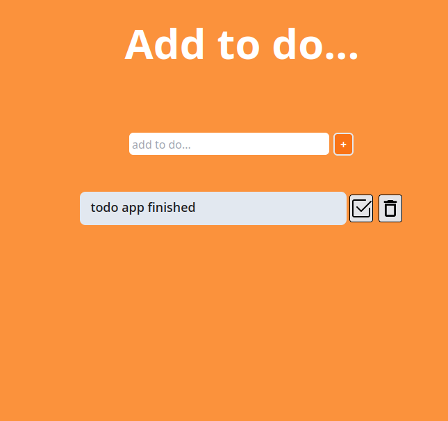
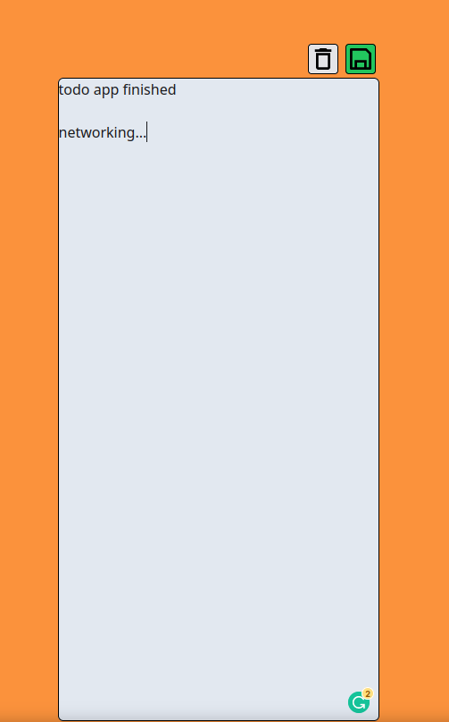

# Todo-App
A full stack todo app with frontend in react and node.js backend

you need npm installed to run this

1. go to root directory of the project in the terminal.
2. run command npm install.
3. in another terminal run node server to start the server.
